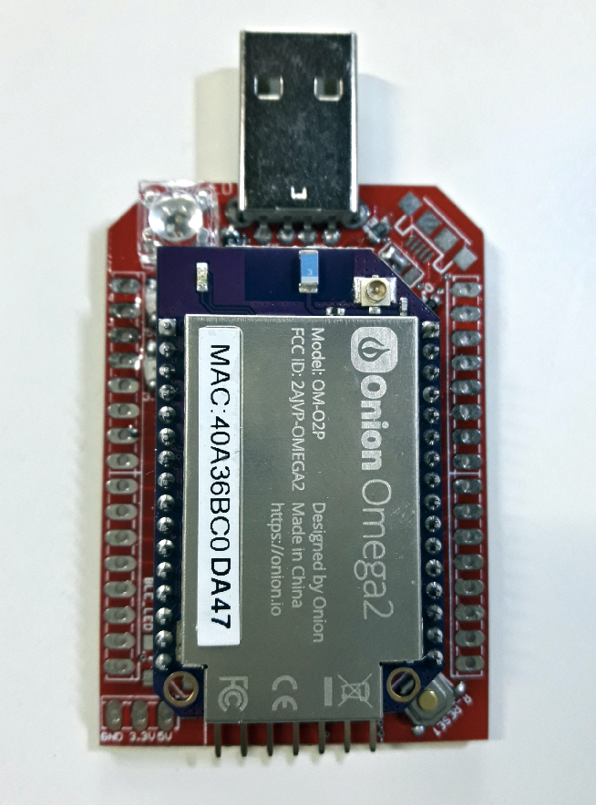

## Onion Omega 2 BLE Pro Expansion Board



[Onion Omega 2](https://onion.io/omega2/) is a $5 Linux computer with Wifi support. It is great for developing Internet of Things (IoT) applications. Unfortunately, the board cannot be powered directly as there is no option for USB power. Also, it uses 2 mm pitch headers which makes it impossible to use with a regular breadboard without any converter/expansion board. Even after powering the Omega 2, accessing the terminal should be done through wifi. All these problems make Omega 2 less easy to get started. 

This expansion board addresses the above-mentioned issues with some additional features at a very low cost compared to the expansion boards [available](https://onion.io/product-category/docks/) from Onion Crop directly. 

**Features:**

- Breakout board for Onion Omega 2 (*2.00mm to 2.54mm*).
- Access Onion Omega 2 Terminal without Wifi Connection.
- Adds BLE support to the Omega 2 (*Software support TBD. Contributions welcomed*).
- Standalone BLE device HM-11 (*Throught Serial AT Commands*). 
- Standalone USB to Serial programmer/debugger. 
- Program any Arduino or ESP8266.
- 5V to 3.3V converter (*Up to 700mA*).
- Onboard RGB LED.
- Contains both USB A Male and Micro USB female (*Selectable via jumpers*).

**Getting Started:**
- Install [CH340G driver](https://sparks.gogo.co.nz/ch340.html) *before* plugging into your computer. Restart the computer if required.
- Plug your Onion Omega 2 into the 2.00mm header. Make sure you plug in the correct orientation (Onion Logo should face the USB port).
- Get to know how to access USB Serial devices. Here are some recommended articles: [Windows](https://software.intel.com/en-us/setting-up-serial-terminal-on-system-with-windows) | [Linux](https://stackoverflow.com/a/6719367) | [Mac](https://software.intel.com/en-us/setting-up-serial-terminal-on-system-with-mac-os-x)
- Open the Serial Console and wait for some time (usually 2 to 3 mins) for the Omega 2 to boot up. You will see a lot of messages like this:
  
- Press Enter key twice. You are good to go. Head over to [Onion Omega 2 Documentation page](https://docs.onion.io/omega2-docs/connecting-to-the-omega-terminal.html#connecting-to-the-omega-terminal-serial) for more information. 

**RGB LED demo**:
- Install [python](https://wiki.onion.io/Tutorials/Installing-Python).
- Enter the command `cd root` and press enter.
- Type `vi RGBDemo.py` and press `i` key.
- Copy paste this code:
```
    import onionGpio
    # for delay
    import time

    # Create GPIO object
    gpioObject17 = onionGpio.OnionGpio(17)
    gpioObject16 = onionGpio.OnionGpio(16)
    gpioObject15 = onionGpio.OnionGpio(15)

    time.sleep(0.01)

    status = gpioObject17.setOutputDirection(1)
    status = gpioObject16.setOutputDirection(1)
    status = gpioObject15.setOutputDirection(1)

    while True:
        for r in range(0,2):
            for g in range(0,2):
                for b in range(0,2):
                    status = gpioObject17.setOutputDirection(r)
                    status = gpioObject16.setOutputDirection(g)
                    status = gpioObject15.setOutputDirection(b)
                    time.sleep(0.01)
```
- Press `ESC` key and press `:wq` and press enter. Now your file will be saved.
- Enter the command `python RGBDemo.py` and press enter. You should see your RGB enter changing its color.
- To terminate the demo press `CTRL + C`.